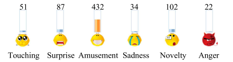

# Social-Emotion-Prediction
A collection of papers on the field of **Social Emotion Prediction**.

Social emotion differs from the emotion expressed by the text's writer, as it reflects the collective emotional response of the audience to the content. The task involves identifying which emotions a text is likely to provoke in its readers, considering that these responses can be influenced by individual backgrounds and personal experiences, which are often unknown.

## Problem Definition

### Given Data:
- **Articles**: A set of news articles $\( D = \{d_1, d_2, \ldots, d_{|D|}\} \)$.
- **Comments**: Corresponding sets of comments $\( C = \{c_1, c_2, \ldots, c_{|D|}\} \)$, each comment set $\( c_i \)$ is associated with an article $\( d_i \)$.

### Emotion Tags:
- A set of predefined emotion tags $\( E = \{e_1, e_2, \ldots, e_{|E|}\} \)$ used for emotional classification.

### Social Emotion Distribution:
- Each article is associated with an emotion rating distribution across these tags, normalized and represented as $\( l_i = [l_{i,e1}, l_{i,e2}, \ldots, l_{i,e|E|}] \)$.

### Article Representation:
- Each article $\( d_i \)$ is divided into blocks $\( \{b_1, b_2, \ldots, b_{|d_i|}\} \)$, each block containing words $\( \{w_1, w_2, \ldots, w_{|b_j|}\} \)$.

### Comment Representation:
- The comments for an article $\( c_i \)$ are represented as a sequence of words from all comments combined.

The goal is to predict the social emotion distribution $\( l_i \)$ for each article based on its content and associated comments.

## Datasets & Surveys
- (*NLPCC'20*) A Large-Scale Chinese Short-Text Conversation Dataset [[paper](https://arxiv.org/abs/2008.03946)] [[code](https://github.com/huggingface/datasets)]
- (*IEEE Transactions on Computational Social Systems*) LCSEP: A Large-Scale Chinese Dataset for Social Emotion Prediction to Online Trending Topics [[paper](https://ieeexplore.ieee.org/document/10379492)]
- (*ACL'20*) Goodnewseveryone: A corpus of news headlines annotated with emotions, semantic roles, and reader perception. [[paper](https://aclanthology.org/2020.lrec-1.194/)] 
- (*Springer'24*) MVIndEmo: a dataset for micro video public-induced emotion prediction on social media [[paper](https://link.springer.com/article/10.1007/s00530-023-01221-8)] [[code](https://github.com/jjInsper/NeurIPS-Dataset-Induced-Emotion/tree/master)]
- (*DATA'21*) A Survey of Social Emotion Prediction Method [[paper](https://researchr.org/publication/AlsaediBGT21)]
- (*ACL'20*) Hashtags, Emotions, and Comments: A Large-Scale Dataset to Understand Fine-Grained Social Emotions to Online Topics [[paper](https://aclanthology.org/2020.emnlp-main.106/)] [[code](https://github.com/polyusmart/HEC-Dataset)]
- (*ACL'16*) SemEval-2016 Task 5: Aspect Based Sentiment Analysis [[paper](https://aclanthology.org/S16-1002/)]
- ISEAR: International Survey on Emotion Antecedents and Reactions [[source](https://www.kaggle.com/datasets/faisalsanto007/isear-dataset)]
- SinaNews: a Chinese news dataset that contains news articles collected from the social channel of the Sina News [[source](https://news.sina.com.cn/ui_index.shtml)]

## Methods Used In This Field
This collenction categorizes the methods into three main types based on their approach:
1. **Word-based Methods**: These methods rely on the assumption that every word, even neutral ones, can be linked to certain emotions. They often use bag-of-words models, dictionaries, and lexical resources to classify emotions.
 
2. **Topic-based Methods**: These methods associate emotions with broader topics or events rather than individual words. They typically use topic modeling techniques, like Latent Dirichlet Allocation (LDA), to create layers that capture the emotional undertones of different topics.
  
3. **Deep Learning Methods**: Utilizing advanced neural network architectures, these methods aim to capture semantic and syntactic nuances that affect emotional interpretation. They often employ embeddings and deep neural networks to better understand the complex patterns that convey emotional content.

### Word-based Methods:
- (*Knowledge-Based Systems*) Hidden topic–emotion transition model for multi-levelsocial emotion detection [[paper](https://www.sciencedirect.com/science/article/pii/S0950705118305586)]
- (*ICAART'22*) Improving Social Emotion Prediction with Reader Comments Integration [[paper](https://livrepository.liverpool.ac.uk/3150843/)]
- (*IEEE International Conference on Machine Learning and Cybernetics*) Predicting Social Emotions based on Textual Relevance for News Documents [[paper](https://ieeexplore.ieee.org/document/9019908)]
- (*IEEE WIECON-ECE*) Emotion prediction of news article from reader's prespective based on multi-label classification[[paper](https://ieeexplore.ieee.org/document/6359686)]
- (*International Conference on Data Technologies and Applications*) EPNDR: Emotion prediction for news documents based on readers’ perspectives. [[paper](https://www.semanticscholar.org/paper/EPNDR%3A-Emotion-Prediction-For-News-Documents-Based-RamyaR-Madhura/8f2f47f23d0501ae9f6526aa4910ab2fcedeba42)]

### Topic-based Methods:
- (*AIII'16*) Topic Modeling in Twitter: Aggregating Tweets by Conversations [[paper](https://lsm.media.mit.edu/papers/topic-modeling-twitter.pdf)]
- (*ACL'21*) Emotion Modeling from Writer/Reader Perspectives Using a Microblog Dataset [[paper](https://aclanthology.org/W11-3703/)]
- (*ICAART'22*) Improving Social Emotion Prediction with Reader Comments Integration [[paper](https://livrepository.liverpool.ac.uk/3150843/)]
- (*arXiv 2018.12*) Latent Dirichlet Allocation and Topic modeling (LDA): models, applications, a survey [[paper](https://arxiv.org/abs/1711.04305)]
- (*Expert Systems with Applications'18*) Universal affective model for Readers’ emotion classification over short texts [[paper](https://www.sciencedirect.com/science/article/abs/pii/S0957417418304445)]
- (*IEEE BigComp*) Weighted multi-label classification model for sentiment analysis of online news [[paper](https://ieeexplore.ieee.org/document/7425916)]
- (*IEEE Intelligent Systems*) Contextual Sentiment Topic Model for Adaptive Social Emotion Classification [[paper](https://ieeexplore.ieee.org/document/7325170)]
- (*Future Generation Computer Systems'14*)Towards building a social emotion detection system for online news [[paper](https://www.sciencedirect.com/science/article/abs/pii/S0167739X13002033)]

### Deep Learning Methods:
- (*ACL'23*) Transformer-based Prediction of Emotional Reactions to Online Social Network Posts [[paper](https://aclanthology.org/2023.wassa-1.31/)]
- (*ACL'22*) XLM-EMO: Multilingual Emotion Prediction in Social Media Text [[paper](https://aclanthology.org/2022.wassa-1.18/)] [[code](https://github.com/milanlproc/xlm-emo)]
- (*ACL'22*) Emotion Analysis of Writers and Readers of Japanese Tweets on Vaccinations [[paper](https://aclanthology.org/2022.wassa-1.10/)] [[code](https://github.com/Ramos-Ramos/BERT-Japan-vaccination)]
- (*ACL'21*) Personal Bias in Prediction of Emotions Elicited by Textual Opinions [[paper](https://aclanthology.org/2021.acl-srw.26/)] [[code](https://github.com/clarin-pl/personal-bias)]
- (*ACL'18*) AnAnalysis of Annotated Corpora for Emotion Classification in Text [[paper](https://aclanthology.org/C18-1179/)]
- (*ACL'18*) NLP at IEST 2018: BiLSTM-Attention and LSTM-Attention via Soft Voting in Emotion Classification [[paper](https://aclanthology.org/W18-6226/)] [[code](https://github.com/lauchblatt/emotions_in_drama)]
- (*Springer'20*) Readers’ affect: predicting and understanding readers’ emotions with deep learning [[paper](https://link.springer.com/article/10.1186/s40537-022-00614-2)]
- (*WWW'20*) An End-to-end Topic-Enhanced Self-Attention Network (TESAN) for Social Emotion Classification [[paper](https://dl.acm.org/doi/abs/10.1145/3366423.3380286)] [[code](https://github.com/CariaWang/TESAN)]
- (*Nature'23*) Emotion classification for short texts: an improved multi-label method [[paper](https://www.nature.com/articles/s41599-023-01816-6)]
- (*IEEE Transactions on Cybernetics*) A Deep Learning Framework for News Readers’ Emotion Prediction Based on Features From News Article and Pseudo Comments [[paper](https://ieeexplore.ieee.org/document/9552625)]
- (*CAC'18*) CNN-SVM with Embedded Recurrent Structure for Social Emotion Prediction [[paper](https://ieeexplore.ieee.org/document/9552625)]
- (*ICAART'22*) Improving Social Emotion Prediction with Reader Comments Integration [[paper](https://livrepository.liverpool.ac.uk/3150843/)]
- (*Neural computing & applications*) Multi-document influence on readers: augmenting social emotion prediction by learning document interactions [[paper](https://link.springer.com/article/10.1007/s00521-024-09420-8)]
- (*Computer Speech & Language*) Predicting emotional reactions to news articles in social networks [[paper](https://www.sciencedirect.com/science/article/abs/pii/S0885230817302322)]
- (*IEEE SNAMS*) Multi-Label Emotion Classification for ArabicTweets [[paper](https://ieeexplore.ieee.org/document/8931715)]
- (*IEEE Transactions on Affective Computing*) Predicting Social Emotions from Readers’ Perspective [[paper](https://link.springer.com/article/10.1007/s00521-024-09420-8)]
- (*IEEE IAEAC*) Social Emotion Prediction with Attention-based Hierarchical Neural Network [[paper](https://ieeexplore.ieee.org/document/8998031)]
- (*IEEE ICMLA*) Transfer Learning model for Social Emotion Prediction using Writers Emotions in Comments [[paper](https://ieeexplore.ieee.org/document/10069074)]
- (*ACL'20*) Learning Emotion from 100 Observations: Unexpected Robustness of Deep Learning under Strong Data Limitations [[paper](https://aclanthology.org/2020.peoples-1.13.pdf)]

## Basic Models Or Componemt In This Field (Especially In Deep Learning Methods):
- Latent dirichlet allocation (*LDA*) [[paper](https://dl.acm.org/doi/10.5555/944919.944937)]
- Convolutional Neural Networks for Sentence Classification [[paper](https://arxiv.org/abs/1408.5882)]
- Long Short-Term Memory (*LSTM*) [[paper](https://ieeexplore.ieee.org/abstract/document/6795963)]
- SegNet: A Deep Convolutional Encoder-Decoder Architecture for Robust Semantic Pixel-Wise Labelling (*Encoder-Decoder*) [[paper](https://arxiv.org/abs/1505.07293#:~:text=SegNet%20is%20composed%20of%20a%20stack%20of%20encoders,stack%20to%20full%20input%20image%20size%20feature%20maps.)]
- Attention Is All You Need (*Transfomer*) [[paper](https://arxiv.org/abs/1706.03762)]
- Empirical Evaluation of Gated Recurrent Neural Networks on Sequence Modeling (*GRU*) [[paper](https://arxiv.org/abs/1412.3555)]
- Efficient Estimation of Word Representations in Vector Space （*Word2Vec*）[[paper](https://arxiv.org/abs/1301.3781)]
- BERT: Pre-training of Deep Bidirectional Transformers for Language Understanding (BERT) [[paper](https://aclanthology.org/N19-1423/)]
  

